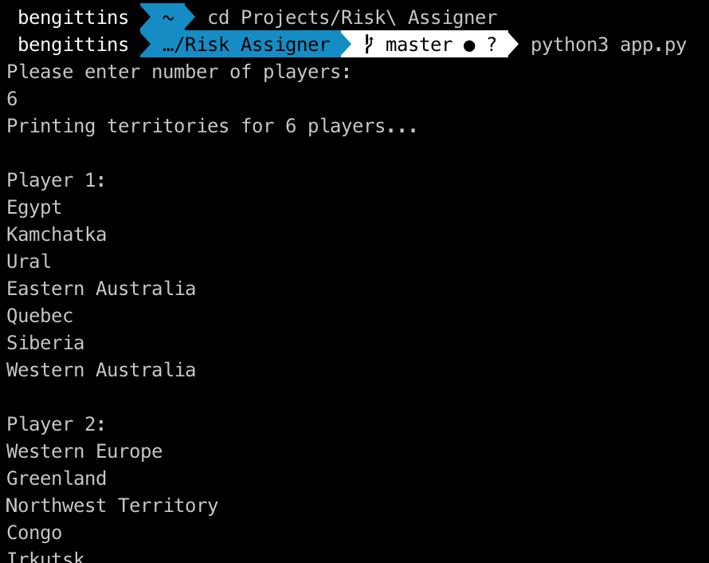

# Risk-Territory-Assigner :game_die:

Simple tool to randomly assign territories to 2 - 6 players at the start of a game of Risk. 

### Why?

As of 22/04/20 players of [Risk: Global Domination](https://store.steampowered.com/app/1128810/RISK_Global_Domination/) are unable to select where to place their armies themselves if they choose to randomly assign territories. This is inconsistent with the tabletop version of the game. 

This app is for groups of friends playing together who wish to maintain this aspect of the traditional game when playing online. 

It could also be used if you are playing the tabletop game but just cant muster the energy to shuffle and deal territory cards...

### Build Status

Basic back end complete (can be run in command line, see [below](#how-to-use)). Front end on its way. 

### Tech

Python / Pytest. 

### How to Use

Clone this repo. Navigate to directory in command line. 

Run the app by typing this in the command line:

``` 
python3 app.py 
```

Input number of players when prompted and you will receive that number of lists of territories, randomised and ready for you to play with: 


